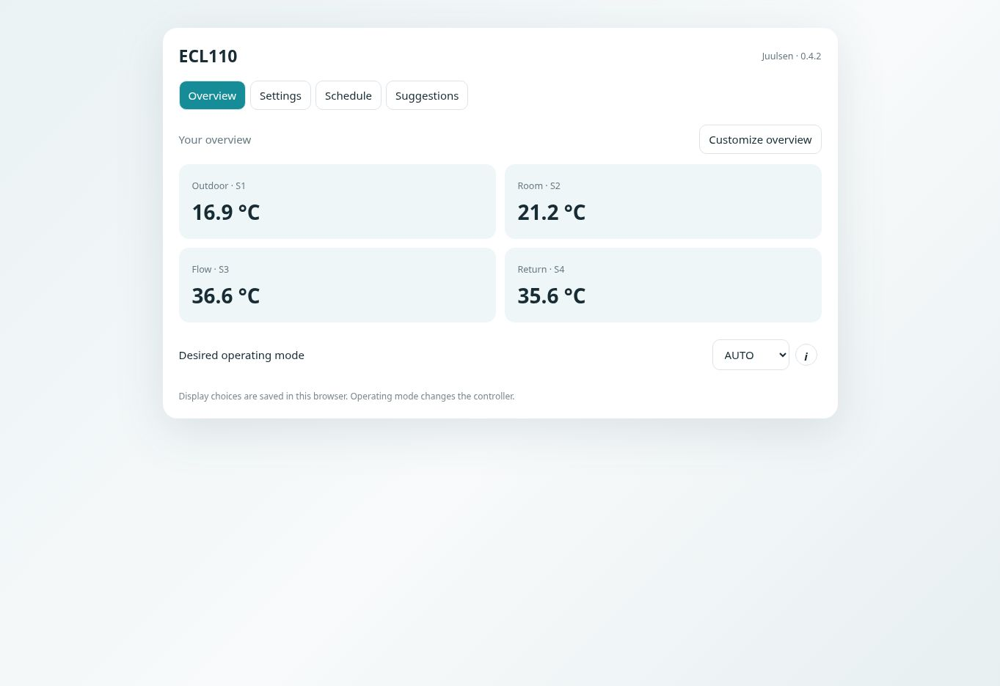
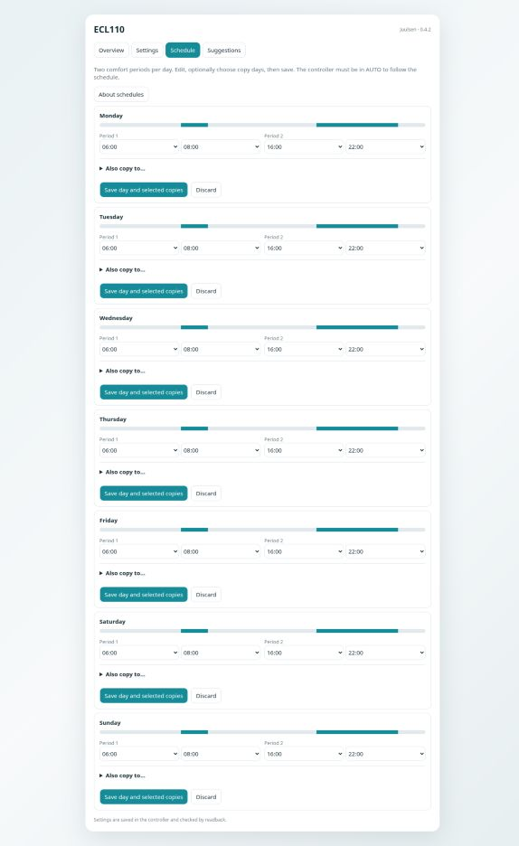

# ECL110 Modbus · Juulsen

[](https://github.com/Juulsen/Danfoss_ecl110/releases/latest)
[](LICENSE)

**Home Assistant control, weekly schedules and contextual help for Danfoss ECL Comfort 110.**

Test version **0.4.3b1** · Local Modbus TCP · Danish / English · Independent community project

## Testing the next update

This branch contains an unreleased test build. No new GitHub release has been published.

- Visual dashboard card editor: controller, language, title, layout, size, field selection, order and custom display names.
- Responsive tiles fill the available card width, with aligned labels and readings.
- Click a reading to open Home Assistant's more-info dialog, including history when recorded by Home Assistant.
- Card branding/version text removed; clearer Danish temperature names retained.
- New connections start with an empty host; existing connections retain their saved host. Modbus device ID uses a numeric box.

After installing this test build, restart Home Assistant and change the dashboard JavaScript resource to `/ecl110-static/ecl110-card.js?v=0.4.3b1`. Reload the browser. Edit the dashboard card to use the visual editor, then press **Save**. These choices are stored with the dashboard and apply across browsers. Custom names only affect this card, including its settings labels; entity IDs and controller values stay unchanged.

For a wide card, use Home Assistant's card **Layout** controls and increase the containing section width. The card fills the space allocated by the dashboard; it cannot enlarge the containing section itself. On a narrow screen, tiles reflow automatically.

Existing browser-only views remain supported until an explicit `overview` is saved in the card configuration. Explicit dashboard configuration takes priority. The in-card customization remains a temporary preview for configured cards; permanent changes belong in the visual editor.

Climate entities and heat-curve graphs are not part of this test build. Hardware operation still needs a user check in Home Assistant; frontend tests use simulated entities.

Developed by **Juulsen**. This integration is not developed, supported or endorsed by Danfoss.

## Project status

> [!WARNING]
> **Active test / beta.** The integration is being tested against a physical ECL110 installation. Features, register definitions and the dashboard can change as more functions are verified. Updates and corrections will be published continuously.

Test new writes carefully and confirm the result on the physical controller. Please report reproducible problems through [GitHub Issues](https://github.com/Juulsen/Danfoss_ecl110/issues), including the integration version, ECL application, expected result and observed result.

## Support the project

If the integration is useful to you, you can support its continued development and testing:

<p align="center">
  <a href="https://www.paypal.me/MIJUTEC">
    
  </a>
</p>

## License

The original code and documentation in this repository are released under the [MIT License](LICENSE).

Product names and trademarks belong to their respective owners. The license does not grant rights to the Danfoss name, logo or trademarks, and linked third-party reference material remains subject to its own terms.

## What's new in 0.4.2

- Added the MIT License for the project's original code and documentation.
- Added license and release badges plus a clear third-party trademark notice.
- Updated the integration and dashboard version to 0.4.2.
- Added screenshots of the overview and weekly schedule, generated from the actual dashboard card.
- No Modbus registers, scaling, writes or runtime behaviour changed in this release.

## Frontend screenshots

The card below is rendered from the integration's actual frontend code with simulated Home Assistant data.

### Overview

<p align="center">
  
</p>

### Weekly schedule

<p align="center">
  
</p>

## What's new in 0.4.1

- Register **11179** has been added as the writable **Desired room temperature** for application 130, with a range of 10–30 °C in whole degrees.
- Register **11228** has been corrected to **Active desired room temperature S2**, read with 0.1 °C resolution.
- Display tests confirm 21 °C → `11179=21` and `11228=210`, and 22 °C → `11179=22` and `11228=220`.
- The room-temperature setting is available under **Settings → Room control** and can also be selected in the customizable overview.
- Register **11180** remains unknown and hidden.

## Version 0.4.0 overview

The layout keeps the tabs **Overview · Settings · Schedule · Suggestions**.

| Feature | How to use it |
|---|---|
| Choose fields | Select **Customize overview**, then choose the measurements or settings you want to display. |
| Reorder fields | Use the up/down arrows next to the selected fields. |
| Layout | Choose **Tiles**, **List** or **First field in focus**. The first selected field is used for focus mode. |
| Size | Choose **Compact**, **Normal** or **Large**. The card also adapts to its available width. |
| Save | **Save view** stores only the card layout and performs no Modbus writes. |
| Help | Select **i** for a plain-language explanation, the effect of a change and relevant examples. Calculations can be expanded when available. |

Display preferences are stored **per Home Assistant user, ECL device and browser**. They are not synchronized automatically between a phone and a computer. Clearing browser data removes the saved preferences. Shared defaults can be defined in the card YAML as described below. All 45 help texts are available in Danish and English; the information dialogs contain no PDF or page references.

## Additional 0.4.0 improvements

- Customizable overview: choose existing entities, reorder them, and select tiles, list or first-field focus.
- Compact, normal and large display sizes; responsive to the card width.
- Local display preferences scoped to user, controller and optional card ID; no Modbus writes for customization.
- Plain-language Danish/English help with effects, examples and expandable calculations. Source references remain in this README.

## Included features

- A dashboard card with **Overview · Settings · Schedule · Suggestions**.
- Settings grouped by ECL menu number, with units and readable choices.
- Information dialogs with plain-language explanations, examples and optional calculations.
- Two comfort periods per day, a timeline and copying to selected weekdays.
- Floor-heating and radiator starting suggestions with an explicit change preview.
- A design heat-curve calculator based on the application 130 guide.
- 23 numeric controls, 10 setting selections and one daylight-saving switch; 28 additional schedule selections are optional.

Numeric ranges introduced in 0.3.0 use the application 130 manual and paired display/raw observations. They are **not all physically write-tested**. The eight controls introduced in 0.2.4 have been reported working by the owner. Every write is still validated, sent using FC06, and checked with an immediate FC03 readback.

## Install / update

1. Download the [repository ZIP](https://github.com/Juulsen/Danfoss_ecl110/archive/refs/heads/main.zip).
2. Extract it and copy the complete `custom_components/danfoss_ecl110_modbus` folder to `/config/custom_components/`, including its `frontend` subfolder.
3. Restart Home Assistant. When updating the card, also change its existing resource URL to `?v=0.4.3b1` and reload your browser. Keep only one ECL110 JavaScript resource.
4. Open **Settings → Devices & services → ECL110 → Reconfigure**.
5. Select the actual application: **130** for room heating, **116** for domestic hot water. Newly expanded heating writes require explicit selection of **130**; `all` does not unlock them.
6. Enable **ECA 110 weekly schedule** only if the controller has its timer program. Setup tests reading all seven days before creating the 28 time selections together.

HACS: the repository can be added as a custom integration repository where repository access and HACS validation permit. This is not a claim of inclusion in the HACS default store.

## Add the dashboard card

No Browser Mod or additional card dependency is needed. The integration serves its bundled files itself.

Add a dashboard **resource** (JavaScript module):

```text
/ecl110-static/ecl110-card.js?v=0.4.3b1
```

Then add a manual card:

```yaml
type: custom:ecl110-card
```

With exactly one ECL110 device, discovery is automatic. With multiple controllers, choose one existing entity from the desired controller:

```yaml
type: custom:ecl110-card
entity: sensor.REPLACE_WITH_YOUR_ECL110_S1_ENTITY
# Optional: language: da
```

This is a dashboard card. Home Assistant's standard device page is not replaced or restyled. Names and entity IDs can be customized normally; discovery uses the integration's attributes rather than guessed IDs.

## Daily operation

**Overview:** initially four temperatures and operating mode. Use **Customize overview** to choose any named, enabled entity for this controller, including available measurements and settings. Unknown registers and schedule time fields are excluded. Disabled entities must first be enabled in Home Assistant. Missing readings show a dash; unknown and unavailable readings are labelled accordingly.

Choose **tiles**, **list** or **focus**, and **compact**, **normal** or **large** in the visual card editor. Move selected fields with the arrow buttons and save the dashboard. For legacy cards without `overview` configuration, the in-card **Save view** still saves in this browser. For configured cards it only previews changes until reload; use the dashboard editor for permanent changes. Display changes do not call Home Assistant services or write registers. The operating-mode control still changes the controller.

For legacy cards without explicit overview configuration, cards for the same user/controller share preferences within the same browser. Give each legacy card a different `overview_id` for independent views. Explicit YAML or visual-editor configuration takes priority over browser choices:

```yaml
type: custom:ecl110-card
entity: sensor.REPLACE_WITH_YOUR_ECL110_S1_ENTITY
overview_id: living_room
language: da
overview:
  fields:
    - temperature_s1
    - temperature_s3
    - temperature_s4
    - desired_s3
    - heating_curve_slope
  layout: tiles  # tiles | list | focus
  size: normal   # compact | normal | large
```

`fields` uses the stable `register_key` shown in the entity attributes, so renaming an entity does not break the selection. Visual-editor and YAML choices travel with the dashboard configuration. Legacy browser customization is browser-specific. These display sizes control content density; set the dashboard card width using Home Assistant's own layout controls.

**Settings:** groups follow the ECL menu structure. Values are in display units; changing an input writes that individual value. The info button explains its purpose and provides relevant formulas. Unsupported or disabled registers appear as read-only; enable a diagnostic sensor if its current reading is needed.

**Schedule:** edit two start/stop pairs, select optional copy days, then save. Editing fields alone performs no writes. Times use half-hour steps, including **24:00**, which is different from 00:00. The card accepts ordered periods within a day; equal start/stop makes a zero-length interval. Overnight periods must be split across days. The controller must be in AUTO and have the ECA 110 timer function for scheduled operation.

A multi-register schedule update is **not atomic**. Writes are individually checked. On failure the operation stops and reports the number confirmed; the last attempted write may also have taken effect. Previously completed writes are not automatically rolled back. Check the controller and reload the card before retrying if communication failed. Avoid simultaneous editing from another client.

**Suggestions:** the floor-heating starting suggestion is slope **0.6**, knee point **OFF**; the radiator starting suggestion is slope **1.2**, knee point **40 °C**. These come from guide examples/defaults, not a design of your installation. Only those two values change after preview and confirmation. No pump limits, return limits, maximum flow temperature or valve travel time are changed by a suggestion. Like schedules, a two-setting update can partially complete.

## Help and calculations

The supplied operating guides were reviewed:

| Guide | Application | Reference |
|---|---|---|
| Weather-compensated heating | 130 | AQ188586469712en-010801, software 1.08 onward |
| Constant domestic-hot-water control | 116 | AQ188586469032en-010701, software 1.08 onward |
| Modbus map | 116/130 | [Ingramz/ecl110](https://github.com/Ingramz/ecl110), firmware 1.06 |

The manual explains menu behaviour; it does not establish every Modbus encoding. The version difference is retained as an uncertainty, not treated as proof of compatibility.

The help covers the following subjects; source page numbers are retained here for maintenance, not shown in dialogs:

- Heat-curve design slope (130 pages 11–12).
- Room influence including heat-curve slope (130 pages 14–16).
- Return influence above/below the limit (130 pages 18–19).
- Two-digit optimizer code (130 pages 21–22).
- PI tuning relationships, as explanation rather than automatic tuning (130 page 27).
- Valve travel time from stroke/speed or angle/speed (130 page 26).
- Symmetrical neutral zone and minimum motor pulse conversion (130 pages 26, 31).

The heat-curve calculator computes a **design slope**, not the exact live target including all controller influences. The guide specifies separate formulas above and below 40 °C; the calculator deliberately does not invent a formula at exactly 40 °C.

## Coverage and limits

112 register addresses are preserved; 86 named readable registers remain available as sensors, plus six optional OFF/Active sensors. The remaining 26 unknown registers stay hidden.

Some items cannot honestly be called finished Modbus controls yet:

- S1 filter **5081** has no confirmed register address.
- Alternate codes for return priority, total stop, pump/valve exercise, actuator type, DHW priority and external override remain unresolved. They are not guessed as 0/1.
- OFF codes for auto-reduction, return integration, heating cut-out, pump frost and backlight are unresolved. Their documented numeric ranges can be used; unknown OFF codes are not sent.
- Network/bus address changes and multi-field clock setting are not exposed for writing.
- Application 116-specific menus **6094, 6095, 6096, 6097, 6129 and 6173** need confirmed Modbus mappings. Heating presets are never offered for 116.
- A full climate entity and direct serial RTU transport remain future work.

Existing sensor IDs are retained. The three OFF/numeric controls introduced as selects in 0.2.4 remain selects, with expanded choices. No forced entity-registry cleanup is performed.

## Communication

Home Assistant → Modbus TCP gateway → RS485 → ECL110. Connection settings remain configurable. Source serial settings are 19200 baud, 8 data bits, even parity, 1 stop bit. The gateway serial configuration is separate from this integration.

Polling and setting writes share an operation lock; a completed older poll cannot overwrite a just-verified write. Reads are grouped only across adjacent named registers. Minimum/maximum flow settings are checked against a fresh reading of the opposite limit before writing.

## Validation

Run decoder and write-boundary tests without Home Assistant:

```sh
python -m unittest discover -s tests -v
```

The tests cover observed raw readings, signed encoding, fractional step rejection, OFF options, translations, schedule boundaries and writes denied for unknown settings. Browser checks use simulated Home Assistant states and service calls. They check saved overview preferences, cancellation, user/card isolation, live readings, unavailable storage, Danish/English help, narrow layouts and unchanged schedule/profile writes. Run them with Playwright and Chromium installed:

```sh
node tests/test_card.cjs
```

An existing Chromium executable can be supplied through `ECL_CHROMIUM_PATH`; optional launch arguments can be supplied as a JSON array through `ECL_CHROMIUM_ARGS`. These checks do not replace installation testing against Home Assistant and the real controller. Version 0.4.1 adds one writable register and corrects one read-only register. The first write from Home Assistant should be tested against the physical controller after updating.

See [CHANGELOG.md](CHANGELOG.md) for version history and [hardware observations](docs/hardware-verification-2026-09-19.md) for the earlier measurement record.
