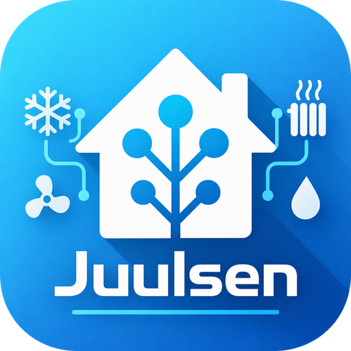

<p align="center">
  
</p>

# ECL110 Modbus · Juulsen

[](https://github.com/Juulsen/Danfoss_ecl110/releases/latest)
[](https://github.com/Juulsen/Danfoss_ecl110/actions/workflows/validate.yaml)
[](https://www.home-assistant.io/)
[](#installation)
[](#status-and-support)
[](#requirements)
[](#dashboard)
[](LICENSE)
[](https://www.paypal.me/MIJUTEC)

**Monitor and control your Danfoss ECL Comfort 110 from Home Assistant, with room-heating climate control, weekly schedules and a customizable dashboard.**

An independent community project by **Juulsen**, under active testing with ongoing updates. Not developed, supported or endorsed by Danfoss. Donations help support development and testing.

## Features

- **Climate entity for application 130:** room-temperature setting and Auto, Comfort, Setback and Standby modes, compatible with Home Assistant's Thermostat card.
- **Overview controls for application 130:** operating mode, heat-curve parallel displacement and boost setting, directly below the readings.
- **Measurements and settings:** temperatures, named parameters, display units and readable options, grouped by ECL menu.
- **Visual dashboard editor:** select and reorder fields, set custom display names, and choose tiles, list or focus layouts in compact, normal or large sizes.
- **History:** click readings to open Home Assistant's more-info dialog; history is available when recorded by Home Assistant.
- **Weekly schedule:** two comfort periods per day, a timeline and copying to selected weekdays; requires the ECA 110 timer function.
- **Danish and English:** frontend and plain-language help with examples and relevant calculations.
- **Heating suggestions:** preview floor-heating or radiator starting values before applying them.

See the [changelog](CHANGELOG.md) for release history. Heat-curve graphs and direct serial RTU support remain future work.

## Requirements

- Home Assistant **2026.6.0 or newer**.
- An ECL Comfort 110 reachable through a **Modbus TCP gateway** connected to its RS485 bus.
- Gateway IP/hostname, TCP port and the ECL's Modbus device ID.
- Correct application selection: **130** for room heating or **116** for domestic hot water. Application 116 has more limited coverage and no room-heating climate entity.

Configure the gateway's serial connection separately to match your controller. This integration connects over TCP; it does not configure the gateway's RS485 settings.

## Installation

### Through HACS

1. In HACS, open **⋮ → Custom repositories**.
2. Add `https://github.com/Juulsen/Danfoss_ecl110` with type **Integration**.
3. Find **ECL110 Modbus by Juulsen**, download it and restart Home Assistant.
4. Open **Settings → Devices & services → Add integration**, search for **ECL110**, and enter your connection details.
5. Select the actual application. Enable **ECA 110 weekly schedule** only if your controller supports it; setup checks that all seven days can be read.

[Inclusion in the HACS default catalog has been requested](https://github.com/hacs/default/pull/11240). Use the custom-repository method until HACS approves and includes it.

### Manual installation

Download the source ZIP from the [latest release](https://github.com/Juulsen/Danfoss_ecl110/releases/latest). Extract it and copy the complete `custom_components/danfoss_ecl110_modbus` folder, including `frontend`, into `/config/custom_components/`. Restart Home Assistant, then add the integration as above.

### Updating

Update through HACS, or replace the complete integration folder manually, then restart Home Assistant. Existing connections and entity IDs are retained. Use **Reconfigure** on the existing integration to change application or connection settings.

For **0.4.5**, update the existing dashboard resource to the URL below and reload the browser. Keep only one ECL110 JavaScript resource.

## Dashboard

Add this dashboard resource as a **JavaScript module**:

```text
/ecl110-static/ecl110-card.js?v=0.4.5
```

Add a manual card:

```yaml
type: custom:ecl110-card
```

One ECL110 device is discovered automatically. With multiple controllers, select the intended controller in the visual card editor, or specify one of its entities:

```yaml
type: custom:ecl110-card
entity: sensor.REPLACE_WITH_YOUR_ECL110_S1_ENTITY
language: da
```

Use the **visual card editor** to choose fields, order, layout, size and custom names, then save the dashboard. Choices are stored with the dashboard and work across browsers. Custom names affect this card only. To make it wider, adjust Home Assistant's card and section layout; the card fills the space allocated to it.

Legacy cards without explicit `overview` configuration can still save browser-local preferences through **Customize overview**. For configured cards, in-card changes are temporary previews; use the visual editor for permanent changes. Appearance changes do not write to the ECL.

The tabs are **Overview · Settings · Schedule · Suggestions**. The card is bundled with the integration and requires no Browser Mod. It does not replace Home Assistant's standard device page.

### Quick heating controls

For application **130**, **Overview** includes the existing mode selector plus:

| Setting | Range and behavior |
| --- | --- |
| Heat-curve parallel displacement | −20 to +20 °C in whole-degree steps. Shifts the curve by the selected temperature difference. |
| Flow temperature boost | Off or 1–99%. Configures extra heat when returning from setback to comfort; this is not an immediate “boost now” command. |

Changes save immediately through the existing validated number/select entities and readback. Neither control changes operating mode or the schedule. The info buttons explain each setting in Danish or English. If a setting entity is disabled, enable it on the ECL110 device page. Unavailable controls are disabled. These heating controls are not shown for application 116 or `all`.

### Screenshots

These examples show **version 0.4.2**, rendered from the real card with simulated data. The current version adds the visual editor and layout improvements.


<details>
<summary>Weekly schedule preview</summary>


</details>

## Room-heating climate entity

Select application **130** to create **Room heating** (**Rumvarme** in Danish). Find it on the ECL110 device page and add it to a standard **Thermostat** card; no extra custom card is needed.

| Control or reading | Behavior |
| --- | --- |
| Target temperature | 10–30 °C in whole-degree steps; register 11179 |
| Current temperature | Actual S2 room sensor; unknown if S2 is absent |
| Auto | Follows the controller's timer when available |
| Heat / Comfort | Comfort operation |
| Setback preset | Reduced-temperature operation; HA mode remains Heat |
| Off / Standby | Standby; ECL frost protection can remain active |
| Active target attribute | `active_target_temperature`, register 11228 divided by 10 |

The writable target and active target can differ because of the schedule or mode. Changing the temperature alone does not change the mode or weekly schedule. Without S2, setpoint and mode control still work, but no measured room temperature is shown. Flow or return readings are never substituted for S2, and heating/idle activity is not inferred.

**ECL110 continues to regulate the heating.** Home Assistant changes its settings rather than running a second thermostat loop. Existing number/select controls remain available.

## Schedules and heating suggestions

**Schedule:** edit two start/stop pairs, optionally select copy days, then save. Editing alone performs no writes. Times use half-hour steps; **24:00 differs from 00:00**. Periods must be ordered within a day; equal start/stop disables that interval. Split overnight periods across days. Scheduled operation requires **AUTO** and the ECA 110 timer function.

**Suggestions:** floor heating proposes slope **0.6** and knee point **OFF**; radiators propose slope **1.2** and knee point **40 °C**. These are starting examples, not a design for your installation. Only these two settings change after preview and confirmation; pump limits, return limits, maximum flow temperature and valve travel time are untouched.

Writes are validated and read back. A schedule, suggestion or combined temperature/mode change uses sequential writes and can **partially complete** if communication fails. Completed writes are not automatically rolled back. Check the controller and refresh the card before retrying; avoid simultaneous changes from another client.

## Coverage and known limits

Named registers are exposed according to the selected application; unknown registers remain hidden. Expanded heating writes require explicit application **130** selection; `all` does not unlock them. Not every documented writable value has been physically tested.

- **S1 filter, menu 5081:** register address is unconfirmed.
- Some alternative option codes and OFF encodings remain unresolved; unsupported values are not guessed or sent.
- Bus-address changes and multi-field clock writes are not exposed.
- Application 116 menus **6094–6097, 6129 and 6173** still need confirmed mappings.
- The heat-curve calculator estimates a **design slope**, not the controller's complete live target. It does not invent a formula at the unresolved 40 °C boundary.

Register definitions are maintained in [registers.py](custom_components/danfoss_ecl110_modbus/registers.py). See the [hardware observations](docs/hardware-verification-2026-09-19.md) for recorded measurements.

## Status and support

The integration is under **active testing**. Confirm new setting changes on the physical controller. Report reproducible problems through [GitHub Issues](https://github.com/Juulsen/Danfoss_ecl110/issues), including integration version, ECL application, expected behavior and observed result. Remove passwords and other private information from logs.

GitHub Actions run **HACS validation, Hassfest, Python tests and frontend contract checks**. These do not replace testing in Home Assistant with a physical controller.

<details>
<summary>Development checks and references</summary>

```sh
python -m unittest discover -s tests -v
node --check custom_components/danfoss_ecl110_modbus/frontend/ecl110-card.js
node tests/test_frontend_contracts.cjs
```

Optional browser tests require Playwright and Chromium: `node tests/test_card.cjs`. Set `ECL_CHROMIUM_PATH` if using an existing Chromium executable.

Reference material:

- Application 130 guide: **AQ188586469712en-010801**, software 1.08 onward.
- Application 116 guide: **AQ188586469032en-010701**, software 1.08 onward.
- [Ingramz/ecl110 Modbus map](https://github.com/Ingramz/ecl110), firmware 1.06.

Manuals describe menu behavior but do not establish every Modbus encoding. Firmware differences remain a compatibility consideration.

</details>

## License

Original code and documentation are released under the [MIT License](LICENSE). Product names and trademarks belong to their respective owners; this license grants no rights to Danfoss trademarks. Third-party reference material retains its own terms.
