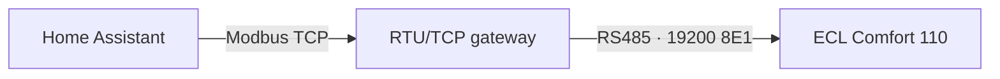

# Danfoss ECL110 Modbus for Home Assistant

[](CHANGELOG.md)
[](https://www.home-assistant.io/)
[](https://www.hacs.xyz/)
[](#communication)
[](#project-status)

A Home Assistant custom integration for monitoring the **Danfoss ECL Comfort 110** through Modbus.

The integration is developed and maintained by **Juulsen**. It is an independent community project and is not developed, supported, or endorsed by Danfoss.

> [!IMPORTANT]
> Version 0.2.2 is a read-only test release. Home Assistant cannot write settings to the controller in this version.

## Highlights

- Configuration through the Home Assistant user interface
- Local polling with no cloud dependency
- Modbus TCP connection through an RTU-to-TCP gateway
- Support for Modbus slave IDs and configurable connection settings
- Register map for applications 116 and 130
- 112 source addresses preserved in the internal map
- 85 named registers available as read-only test entities
- 27 undocumented addresses retained as metadata but hidden from Home Assistant
- Danish and English entity translations
- Conservative polling designed for a shared RS485 bus
- Signed temperature decoding and disconnected-sensor handling
- Register address, access type, confidence and source exposed as entity attributes

## Project status

| Area | Status |
|---|---|
| Modbus TCP connection | Working |
| S1-S4 temperatures | Hardware tested |
| Complete named register map | Ready for hardware testing |
| Danish translation | Included |
| English translation | Included |
| Writing parameters | Disabled |
| HACS custom repository | Preparing |
| HACS default repository | Not submitted |

The project currently prioritizes safe observation and verification. Registers documented as writable by the source are still exposed as read-only sensors until their scaling, ranges and behaviour have been verified on real hardware.

## Communication

The ECL Comfort 110 communicates using Modbus RTU. A Modbus TCP gateway can be used between Home Assistant and the RS485 bus.



Known RTU settings from the reverse-engineered source:

| Setting | Value |
|---|---:|
| Baud rate | 19200 |
| Data bits | 8 |
| Parity | Even |
| Stop bits | 1 |
| Modbus function used for reading | FC03 |
| Register table | Holding registers |

The TCP host, port and Modbus slave ID are configurable and must match the local gateway and controller.

## Requirements

- Home Assistant with support for custom integrations
- Danfoss ECL Comfort 110
- Application 116, application 130, or an installation where the application is not yet known
- An RS485-to-Modbus-TCP gateway
- Correct RS485 wiring and serial configuration
- Network access from Home Assistant to the gateway

## Installation

### Manual installation

Manual installation is currently recommended while the integration is being hardware-tested.

1. Download the repository as a ZIP file.
2. Extract the archive.
3. Copy this directory:

```text
custom_components/danfoss_ecl110_modbus
```

to:

```text
/config/custom_components/danfoss_ecl110_modbus
```

The resulting structure must be:

```text
/config/custom_components/danfoss_ecl110_modbus/
├── __init__.py
├── config_flow.py
├── const.py
├── coordinator.py
├── manifest.json
├── modbus_client.py
├── registers.py
├── sensor.py
└── translations/
    ├── da.json
    └── en.json
```

4. Restart Home Assistant.
5. Open **Settings → Devices & services**.
6. Select **Add integration**.
7. Search for **Danfoss ECL110 Modbus**.

### HACS

HACS packaging is being prepared. Until the repository is public and has a published release, use manual installation.

When HACS support is released, this repository will be installable as a custom integration repository.

## Configuration

The setup flow performs a harmless read-only test of register 11200 before saving the configuration.

| Field | Description | Default |
|---|---|---:|
| Host | Modbus TCP gateway address | Local gateway address |
| Port | Modbus TCP port | `502` |
| Modbus slave ID | ECL110 address on the RS485 bus | Configurable |
| Application | `116`, `130`, or `all` | `all` |
| Update interval | Seconds between polls | `15` |
| Timeout | Communication timeout in seconds | `5` |
| Request delay | Pause between Modbus requests | `0.10` |

For a shared RS485 bus, keep a reasonable update interval and request delay.

## Decoding in version 0.2.2

Parameter names, display units and numeric ranges follow the Danfoss application 116/130 operating guides (software 1.08 onward). The Modbus source was researched on software 1.06; wire scaling remains inferred where that source says TODO: FORMAT.

- Minimum actuator pulse: setting 10 means **200 ms**, using 20 ms per step.
- Signed examples: 65521 becomes **-15 °C**; 65516 becomes **-2.0** for return influence.
- Temperature differences (Xp, Nz and curve displacement) use **K**, without an absolute-temperature device class.
- Desired S3: 321 is provisionally shown as **32.1 °C**; verify against the controller.
- Clock year: 26 becomes **2026**.
- Unknown OFF codes outside the documented numeric range show **unknown**. Inspect `raw_value` and `decoding_note`; do not interpret raw 9 or 29 as minutes or degrees.
- GEAR/ABV and other unverified option codes remain raw numbers. Readings do not enable writes.

These metadata changes preserve entity identifiers. Restart Home Assistant after updating; user-assigned entity names are retained.

## Register model

The register map is based on the reverse-engineered [Ingramz/ecl110](https://github.com/Ingramz/ecl110) project for application 116/130 and software version 1.06.

Each mapped register includes metadata for:

- Modbus address
- Holding-register type
- Function code
- Read/write indication from the source
- Application compatibility
- Signed or unsigned 16-bit decoding
- Scaling and unit
- ECL menu line when known
- Confidence level
- Safe-write status

### Entity policy in version 0.2.2

- S1-S4 are enabled by default.
- All other named registers are created but disabled by default.
- Unknown addresses are not created as Home Assistant entities.
- Enabling an entity adds its register to the polling set.
- Adjacent registers are grouped into bounded read blocks.
- Undocumented gaps are not read as part of a block.

This design prevents the integration from polling every address continuously and reduces load on slower or shared RTU networks.

## Testing the complete register map

After installing version 0.2.2:

1. Confirm that S1-S4 still update.
2. Open the ECL110 device in Home Assistant.
3. Open **Entities** and filter for disabled entities.
4. Enable 5-10 entities at a time.
5. Reload the integration.
6. Compare values with the ECL110 display and menu.
7. Check the Home Assistant log for Modbus exception responses.

A useful first test group is:

- Modbus address
- Language
- Desired operating mode
- Clock hour
- Clock minute
- Clock day
- Clock month
- Clock year

Do not enable all entities at once on a shared RS485 bus.

## Temperature handling

S1-S4 are decoded as signed 16-bit values with a scale of 0.1 °C.

The raw value `1920`, corresponding to 192.0 °C, is treated as a disconnected sensor and displayed as unknown.

The physical purpose of S1-S4 depends on the active ECL application and the installation wiring.

## Languages

The integration currently includes:

- Danish (`da`)
- English (`en`)

English is the fallback when a Home Assistant language does not have a dedicated translation file.

Additional languages can be added after the register names and behaviour are confirmed by hardware testing.

## Troubleshooting

### Integration is not shown

Verify that `manifest.json` is located directly at:

```text
/config/custom_components/danfoss_ecl110_modbus/manifest.json
```

Restart Home Assistant and refresh the browser.

### Cannot connect to the gateway

Check:

- Gateway IP address and TCP port
- Network/VLAN routing
- That the gateway is listening for Modbus TCP connections
- That another client is not locking the serial interface

### Gateway connects but ECL110 does not respond

Check:

- Modbus slave ID
- RS485 A/B polarity
- Common reference/GND where required
- 19200 baud, 8 data bits, even parity and 1 stop bit
- RTU bus termination and biasing
- That each device on the bus has a unique address

### Newly enabled entity remains unavailable

Reload the integration after enabling the entity. If it still remains unavailable, inspect the Home Assistant log for an illegal-address or timeout response.

The register may be application-specific or unsupported by the installed firmware.

### Old “Unknown register” entities remain

Entities created by an older integration version can remain in Home Assistant's entity registry. Delete those unavailable legacy entities manually, or remove and re-add the integration for a clean registry.

## Safety and limitations

- The register source is reverse-engineered and not official Danfoss documentation.
- Application and firmware differences may change register behaviour.
- Write support remains disabled until each parameter has been verified.
- Changing heating-controller parameters can affect comfort, energy use and frost protection.
- Home Assistant must not be the only protection mechanism for safety-critical heating functions.
- Always preserve the ECL110's normal local control and protection functions during testing.

## Roadmap

- [x] Modbus TCP client and UI configuration
- [x] Initial S1-S4 hardware test
- [x] Full source register map
- [x] Danish and English entity translations
- [x] Read-only staged polling
- [ ] Hardware verification of the 85 named entities
- [ ] Confirm scaling and limits for writable parameters
- [ ] Add `number`, `select`, `switch` and time-control platforms
- [ ] Add diagnostics export
- [ ] Add HACS metadata, validation actions and brand assets
- [ ] Publish the first GitHub release
- [ ] Submit for HACS inclusion

## Project structure

```text
custom_components/danfoss_ecl110_modbus/
├── __init__.py          # Integration lifecycle
├── config_flow.py       # Home Assistant setup flow
├── const.py             # Constants and defaults
├── coordinator.py       # Poll scheduling and read blocks
├── manifest.json        # Home Assistant integration metadata
├── modbus_client.py     # Serialized Modbus TCP client
├── registers.py         # Register definitions and decoding
├── sensor.py            # Read-only Home Assistant entities
└── translations/       # User-interface translations
```

## Changelog

See [CHANGELOG.md](CHANGELOG.md) for version history and upgrade notes.

## Issues and contributions

Use [GitHub Issues](https://github.com/Juulsen/Danfoss_ecl110/issues) for:

- Reproducible communication errors
- Confirmed register values
- Application 116/130 differences
- Translation corrections
- Feature proposals

When reporting a register issue, include the register address, ECL application, firmware version, raw value and expected display value when possible.

## Credits

- Developed and maintained by **Juulsen**
- Register research based on [Ingramz/ecl110](https://github.com/Ingramz/ecl110)
- Built for [Home Assistant](https://www.home-assistant.io/)
- Distribution preparation for [HACS](https://www.hacs.xyz/)

## Trademark notice

Danfoss and ECL Comfort are trademarks of their respective owner. Their names are used only to identify compatible hardware. This independent project is not affiliated with, endorsed by, or supported by Danfoss.

